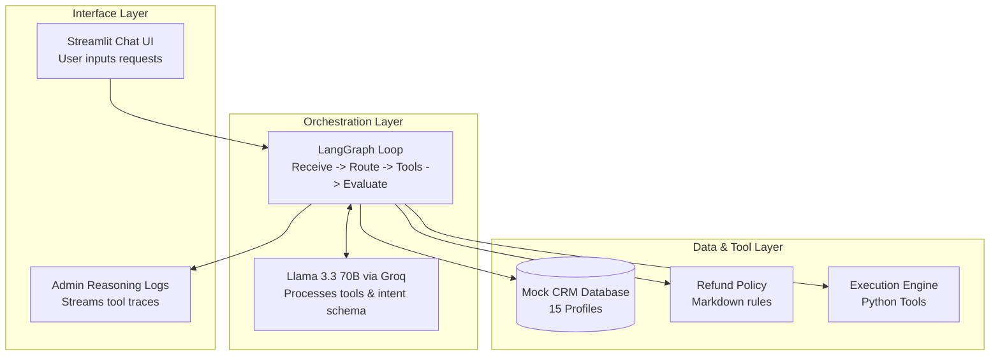

# AI Customer Support Agent: E-Commerce Refund Vertical Slice

A functional, production-ready AI Customer Support Agent that evaluates and processes e-commerce refund requests. This project demonstrates structured tool calling, strict policy enforcement, and real-time reasoning observability using open-source Large Language Models (LLMs) and deterministic graph-based orchestration.

## Technical Stack

* **Core Engine:** Llama 3.3 (70B Instruct) via Groq API for state-of-the-art native tool-calling capabilities and sub-second inference speeds.
* **Orchestration:** LangGraph state machine to enforce deterministic validation pipelines, ensuring the LLM strictly adheres to policy boundaries.
* **Frontend & Dashboard:** Streamlit interface featuring an interactive user chat alongside a real-time reasoning and token trace panel.
* **Mock CRM & Policy Layer:** Local JSON database (15 consumer profiles) and a strict Markdown policy engine, eliminating cloud-config friction for reviewers.

## System Architecture

The application decouples user interaction from the agentic decision loop, enforcing strict boundary layers between the LLM engine and backend transactional state tools.


## Agent Logic Execution Flow

The agent transitions through a predictable lifecycle to process any incoming customer input:

1.  **Extract Intent:** The agent determines if the user is asking about a refund, order status, or general inquiry.
2.  **Context Loading (CRM):** If a refund is requested, the agent invokes `fetch_customer_profile()` to pull order history, account status, and dates from the mock CRM.
3.  **Policy Guarding:** The agent executes `validate_against_policy()`, cross-referencing the order date against strict policy timelines (e.g., the 14-day window constraint).
4.  **Deterministic Evaluation:** The orchestration engine verifies the output fields from the policy tool. If conditions fail, the state graph routes directly to a polite denial, ensuring the LLM cannot override the constraint through conversational manipulation ("holding the line").
5.  **Execution or Escalation:** Eligible requests trigger `execute_refund()`. High-friction scenarios or edge cases invoke `escalate_to_human()`.

## Directory Structure
```text
├── app.py                 # Streamlit UI, split layouts, and state rendering
├── agent.py               # LangGraph state machine definition and node routers
├── tools.py               # Python tools bound to the LLM (docstrings, type hints)
├── config.py              # LLM client setup (Groq/Ollama instantiation)
├── data/
│   ├── crm_mock.json      # 15 pre-configured mock user profiles
│   └── refund_policy.md   # Markdown file containing strict refund parameters
├── requirements.txt       # Python dependency declarations
└── README.md              # Project documentation
```
